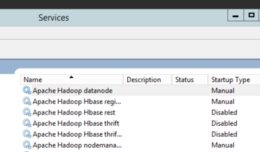

# Guide: Adding a slave node to an existing HDP for Windows cluster.

Hadoop is a horizontally scalable data platform. You add storage and 
processing capacity to the system by adding more nodes to the cluster. This 
guide will outline how to add one node to an existing cluster.

This guide was developed for HDP 2.0 for Windows. The commands and steps were 
carried out on a Windows Server 2012 R2 set of machines.

### Start with an existing HDP for Windows cluster

For this guide, I've started with a single node HDP 2.0 for Windows cluster. 
It has every HDP service component installed, all on the single node's host
name. It is using Derby for the metastore database.

The cluster properties used for this single node cluster:

    #Log directory
    HDP_LOG_DIR=c:\hadoop\logs

    #Data directory
    HDP_DATA_DIR=c:\hdpdata

    #hosts
    NAMENODE_HOST=WIN-NJT8GP7961S
    SECONDARY_NAMENODE_HOST=WIN-NJT8GP7961S
    RESOURCEMANAGER_HOST=WIN-NJT8GP7961S
    HIVE_SERVER_HOST=WIN-NJT8GP7961S
    OOZIE_SERVER_HOST=WIN-NJT8GP7961S
    WEBHCAT_HOST=WIN-NJT8GP7961S
    SLAVE_HOSTS=WIN-NJT8GP7961S
    CLIENT_HOSTS=WIN-NJT8GP7961S
    HBASE_MASTER=WIN-NJT8GP7961S
    HBASE_REGIONSERVERS=WIN-NJT8GP7961S
    ZOOKEEPER_HOSTS=WIN-NJT8GP7961S
    FLUME_HOSTS=WIN-NJT8GP7961S

    #Database host
    DB_FLAVOR=DERBY
    DB_HOSTNAME=WIN-NJT8GP7961S
    DB_PORT=1527

    #Hive properties
    HIVE_DB_NAME=hive
    HIVE_DB_USERNAME=hive
    HIVE_DB_PASSWORD=hive

    #Oozie properties
    OOZIE_DB_NAME=oozie
    OOZIE_DB_USERNAME=oozie
    OOZIE_DB_PASSWORD=oozie
  
### Adding a slave node

A slave node is characterized as a node in the HDP cluster that only runs slave 
HDP components. In this cluster, that would entail a DataNode, a NodeManager, 
and an HBase RegionServer.

We want to add one slave node to this existing cluster. The slave node will point to all the master services that are running on the single node cluster.

We take the cluster properties file from host 1, and copy it over to the node that will be added. Then modify the cluster properties file by adding the second node's host name to the slave host lines.

My second node's hostname is 'WIN-NODE2':

    > hostname
    WIN-NODE2

In the cluster properties file, I add to the following lines:

    # Add to HDFS/YARN slaves
    SLAVE_HOSTS=WIN-NJT8GP7961S,WIN-NODE2

    # Add to HBase region servers
    HBASE_REGIONSERVERS=WIN-NJT8GP7961S,WIN-NODE2

With these two additions, the cluster properties file on WIN-NODE2 now looks 
like this:

    #Log directory
    HDP_LOG_DIR=c:\hadoop\logs

    #Data directory
    HDP_DATA_DIR=c:\hdpdata

    #hosts
    NAMENODE_HOST=WIN-NJT8GP7961S
    SECONDARY_NAMENODE_HOST=WIN-NJT8GP7961S
    RESOURCEMANAGER_HOST=WIN-NJT8GP7961S
    HIVE_SERVER_HOST=WIN-NJT8GP7961S
    OOZIE_SERVER_HOST=WIN-NJT8GP7961S
    WEBHCAT_HOST=WIN-NJT8GP7961S
    SLAVE_HOSTS=WIN-NJT8GP7961S,WIN-NODE2
    CLIENT_HOSTS=WIN-NJT8GP7961S
    HBASE_MASTER=WIN-NJT8GP7961S
    HBASE_REGIONSERVERS=WIN-NJT8GP7961S,WIN-NODE2
    ZOOKEEPER_HOSTS=WIN-NJT8GP7961S
    FLUME_HOSTS=WIN-NJT8GP7961S

    #Database host
    DB_FLAVOR=DERBY
    DB_HOSTNAME=WIN-NJT8GP7961S
    DB_PORT=1527

    #Hive properties
    HIVE_DB_NAME=hive
    HIVE_DB_USERNAME=hive
    HIVE_DB_PASSWORD=hive

    #Oozie properties
    OOZIE_DB_NAME=oozie
    OOZIE_DB_USERNAME=oozie
    OOZIE_DB_PASSWORD=oozie

Using this cluster properties file, we install HDP for Windows on the second node:

    msiexec /qn /i "hdp-2.0.6.0.winpkg.msi" /lv "hdp.log" HDP_LAYOUT="C:\install\clusterproperties.txt" HDP_DIR="C:\hdp\hadoop" HDP_USER_PASSWORD="hadoop_user_pass" DESTROY_DATA="YES"

Upon successful completion of the installer, you will have a two node HDP Windows cluster - one with all the master services and slave services, and another with just the slave services.

Only slave services are installed:

Start these services:

    C:\hdp> start_local_hdp_services.cmd

The DataNode, NodeManager and RegionServer should start.
<!--
You can verify by going to the NameNode UI and looking at the DataNodes:

 

-->
